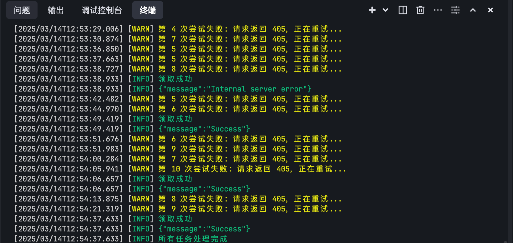

# Monad Faucet

This is a simple monad faucet.
Monad 自动化领水脚本

TG ✈️ t.me/Web3um

# 配置文件说明
 - 动态代理必须要使用 格式 http//username:password@ip:port
 - nocaptcha 验证码API 
   注册链接 https://www.nocaptcha.io/register?c=Ka7soJ 
   新人注册后加QQ群:120639 找管理领取10000点测试点数

# 编译好的可执行文件 使用方法
- 不会编译的就直接在 bin/目录下下载对应的系统版本
运行方法：
Win ：
./faucet.exe
Linux:
./faucet
Mac :
./faucet